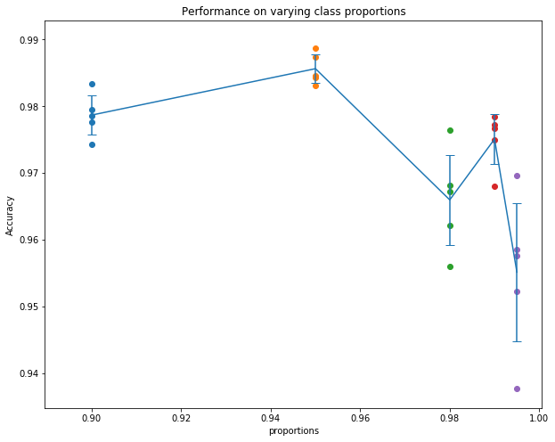

# Learning to Reweight Examples for Robust Deep Learning

Unofficial PyTorch implementation of [Learning to Reweight Examples for Robust Deep Learning](https://arxiv.org/abs/1803.09050). 

The paper addresses the problem of imbalanced and noisy datasets by learning a good weighting of examples using a small clean and balanced dataset.

Please Let me know if there are any bugs in my code. Thank you! =)

I implemented this on Python 3.6 using PyTorch 0.4.0.

### Dataset
I only ran the experiments for the class imbalance problem. Following the paper, I created an imbalanced training dataset using class '4' and '9' of the MNIST dataset, where '9' is the dominant class. (code for creating the dataset is in data_loader.py)

Note that the test set used to measure the performance is balanced.

### Some Results
We can see that even at 0.995 proportion of the dominant class in the training data, the model still reaches 90+% accuracy on the balanced test data.

### Acknowledgements
Adrien Ecoffet: https://github.com/AdrienLE
